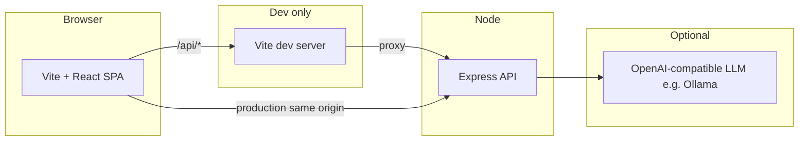

# Architecture overview

Short map of the running system. For depth, see [technical-specification.md](./technical-specification.md) and [planning/](./planning/).

## Runtime

- **Development:** the UI is served by Vite (default port `5173`). Requests to `/api` are proxied to Express (`API_PORT`, default `3001`). See `client/vite.config.ts`.
- **Production:** Express serves the built static client and handles `/api` on one origin (see `server/src/app.ts` when `NODE_ENV === 'production'`).

## Repositories layout

| Path | Role |
|------|------|
| `client/` | React UI, CSS Modules, `fetch` to `/api` |
| `server/` | Express, analysis/LLM helpers, job stub |
| `docs/` | Human-written specs and this overview |
| `build/` | Production output (from `npm run build`) |

## Request flow (analysis)

1. Client calls `POST /api/analyze` with component fields → receives `jobId` (`202`).
2. Client polls `GET /api/status/:jobId` until `completed` or `failed`.
3. Client loads `GET /api/manual-test/:jobId` for the walkthrough payload.

The current server may use an **in-memory stub** for jobs (see `server/src/app.ts`); replace with the real pipeline described in the technical spec as it lands.

## LLM usage

- **`POST /api/infer-component`** — classifies pasted source (language, pattern label, description); uses `LLM_API_URL` when configured.
- **`GET /api/health/llm`** — reachability probe (not a full completion).

Details: [configuration.md](./configuration.md), [api-contracts.md](./api-contracts.md).
