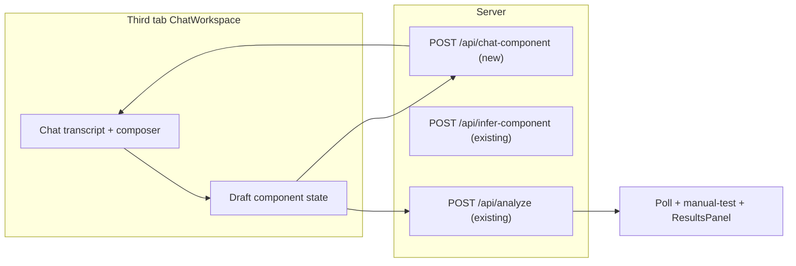

# 023 — Third tab: chat-first component capture

## Context

Today the shell exposes two tabs (see `020-frontend-shell.md` and the live `AppShell` pattern):

| Tab | Role |
|-----|------|
| **Overview** | Multi-field form → `submitAnalysis` → poll → results |
| **One input** | Single paste + `parseCombinedInput` + `/api/infer-component` → structured fields → analyze |

We want a **third tab** where the user moves **beyond a single field** into a **conversation**: natural language to describe and share a component (with optional pasted code/CSS/JS in messages), then land on the same analysis pipeline.

This doc is the **plan**; implementation can be phased.

---

## Goals

1. **Third tab** in the shell (consistent tablist / `tabpanel` / keyboard nav with existing tabs).
2. **Chat UX**: scrollable transcript, composer, clear roles (user vs assistant), loading / error states.
3. **Outcome**: produce a **`AnalyzeRequest`-shaped draft** (or equivalent) so we can call existing **`POST /api/analyze`** + poll + `ResultsPanel` — no parallel results stack unless we intentionally share one.
4. **MVP-friendly**: align with **no server-side chat persistence** (stateless HTTP); conversation history can live in React state and be sent with each request.

Non-goals for MVP (optional later):

- Server-stored threads, user accounts, sharing links.
- True SSE/WebSocket streaming (can add after happy path works with single JSON responses).

---

## High-level architecture



**Recommendation:** add a dedicated **`POST /api/chat-component`** rather than overloading `/api/infer-component`:

- **Infer** today: one-shot “split this blob into code/language/css/js”.
- **Chat** needs: **messages + optional current draft**, return **assistant reply** + **updated structured draft** (and flags like `readyToAnalyze`).

Reusing infer internally (e.g. when the user pastes a big block) is fine as a **tool** inside the chat handler.

---

## Client work

### 1. Shell: third tab

- Extend `TABS` in `AppShell` with e.g. `{ id: 'chat', label: 'Chat' }` (copy can be refined: “Assistant”, “Describe”, etc.).
- Add `tabpanel` section rendering **`ChatWorkspace`** (new page component), matching `hidden` / `aria-*` pattern used for Overview and One input.
- Styles: reuse shell tokens from `AppShell.module.css`; chat-specific layout in `ChatWorkspace.module.css`.

### 2. `ChatWorkspace` component

**State (client-only MVP):**

- `messages: { id, role: 'user' | 'assistant', content, createdAt }[]`
- `draft: Partial<AnalyzeRequest> | null` — language, code, description, css, js
- `status: 'idle' | 'sending' | 'error'` + error string
- Optional: `analysisJobId` / reuse same “results pane” pattern as other tabs (see below)

**UI pieces:**

- Transcript region (`role="log"` or polite `aria-live` for new assistant messages — pick one pattern and test with SR).
- Composer: textarea + send; support Shift+Enter vs Enter (document in UI).
- Optional **draft summary** card above composer: “Detected language: …”, truncated code preview, **Edit** opens expandable fields or `CodeEditor` for final tweaks.
- Primary CTA: **Run analysis** (enabled when `draft.code` is non-empty and passes same validation as other flows).

**Results:**

- **Option A (fastest):** duplicate the right-hand “progress + ResultsPanel” column inside `ChatWorkspace` (same as Classic workspace layout).
- **Option B:** extract a shared **`AnalysisResultsPane`** hook/component used by Classic, One input, and Chat (cleaner, slightly more refactor).

### 3. API client

- `postChatComponentTurn(body)` → typed response:

```ts
// Illustrative — finalize during implementation
interface ChatComponentMessage {
  role: 'user' | 'assistant';
  content: string;
}

interface ChatComponentRequest {
  messages: ChatComponentMessage[];
  draft?: Partial<AnalyzeRequest>;
}

interface ChatComponentResponse {
  assistantMessage: string;
  draft: Partial<AnalyzeRequest>;
  readyToAnalyze?: boolean; // optional hint for UI
}
```

- Reuse existing `submitAnalysis`, `pollJobStatus`, `getManualTestResults` for the run phase.

---

## Server work

### 1. New route `POST /api/chat-component`

- **Auth / limits:** same spirit as other routes — body size cap (aggregate messages + draft), rate limit (reuse middleware from `005-middleware.md` when wired).
- **LLM:** OpenAI-compatible chat completion (reuse `LLM_API_URL` / headers from existing LLM helpers).
- **Prompt contract:** system prompt instructs the model to:
  - Be concise; ask clarifying questions when needed.
  - Always return **structured JSON** (via `response_format` or strict parsing) matching `ChatComponentResponse` / draft fields — same discipline as `inferComponentFromPaste`.
  - Never execute code; treat user content as untrusted text.
- **Optional:** if last user message looks like a “paste blob”, call existing infer logic to seed `draft` before or after the chat completion.

### 2. Types

- Add shared types in `server/src/types/` (and mirror or import from `client` shared package if the repo already shares types — follow `004-shared-types.md`).

### 3. Tests

- Vitest: mock `fetch` to LLM; assert validation errors, happy path JSON shape, oversized payload 413/400.

---

## Product / UX decisions (resolve early)

1. **Tab name and positioning** — e.g. third tab “Chat” vs “Assistant”; order after “One input” vs before.
2. **When to suggest “Run analysis”** — only when `code` present vs model `readyToAnalyze`.
3. **Clear conversation** — button to reset messages + draft without leaving tab.
4. **Privacy copy** — short note that messages are sent to the configured LLM endpoint (deployment-specific).

---

## Implementation phases

| Phase | Deliverable |
|-------|-------------|
| **P0** | Tab + static chat UI + client state only (mocked responses or echo) to validate layout/a11y |
| **P1** | `POST /api/chat-component` + real LLM + draft extraction |
| **P2** | Wire **Run analysis** + results panel; parity with other tabs |
| **P3** | Optional: streaming, suggested replies, “apply infer to last message” button |

---

## Dependencies

- `001-basic-setup`, `020-frontend-shell`, `007-api-routes` (patterns).
- Existing **`/api/infer-component`** and **`AnalyzeRequest`** types.
- `016-llm-orchestrator.md` for longer-term consolidation (chat can start as a thin route + prompt, then move into orchestrator).

---

## Open questions

1. Should the chat **replace** one-input for some users, or stay a third path permanently?
2. Do we need **file upload** in chat (e.g. `.tsx` file) in MVP, or paste-only?
3. Maximum **turn count** / conversation length before forcing “Run analysis” or summarization (token/cost control)?
